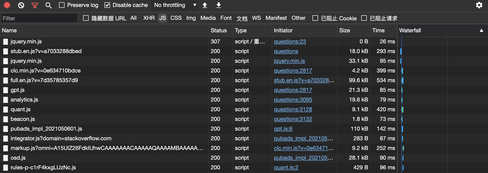

# Replace Google CDN

[](https://github.com/justjavac/ReplaceGoogleCDN/issues) [](https://github.com/justjavac/ReplaceGoogleCDN/releases)
[](https://chrome.google.com/webstore/detail/kpampjmfiopfpkkepbllemkibefkiice)

将 Google CDN 替换为国内的。

## 缘起

> 由于众所周知的原因，只需替换一个域名就可以继续使用 Google 提供的前端公共库了。
> 同样，通过 `script` 标记引用这些资源，让网站访问速度瞬间提速！

很多网站，尤其是国外网站，为了加快网站的速度，都使用了 Google 的 CDN。
但是在天朝，由于某些原因，导致全球最快的 CDN 变成了全球最慢的。

于是，我写了这个插件/扩展，将 Google 的 CDN 替换成国内的。

## 原理

此插件/扩展可以将以下的 cdn 资源替换为国内的：

1. `ajax.googleapis.com` - 前端公共库，替换为 `ajax.loli.net`
1. `fonts.googleapis.com` - 免费字体库，替换为 `fonts.googleapis.cn`
1. `themes.googleusercontent.com` - fonts 有时会使用到这个里面的资源，替换为 `themes.loli.net`
1. `fonts.gstatic.com` - 免费字体库，替换为 `fonts.gstatic.cn`
1. `www.google.com/recaptcha` - Google 图像验证库，替换为 `www.recaptcha.net/recaptcha`
1. `secure.gravatar.com` - gravatar 头像，替换为 `gravatar.loli.net`
1. `maxcdn.bootstrapcdn.com/bootstrap` - bootstrap 框架使用的 CDN，替换为 `lib.baomitu.com/twitter-bootstrap/`
1. `code.jquery.com/jquery-(version)(suffix)` - jquery 框架使用的 CDN，替换为 `lib.baomitu.com/jquery/$verson/$suffix`
1. `cdnjs.cloudflare.com` - 替换为 `cdnjs.loli.net` 默认未启用, 需要请自行打开
1. `cdn.jsdelivr.net` - 替换为 `fastly.jsdelivr.net`
1. `developers.google.com` - 替换为 `developers.google.cn`
1. `developer.android.com` - 替换为 `developer.android.google.cn`
1. `source.android.com` - 替换为 `source.android.google.cn`
1. `www.gstatic.com` - 替换为 `www.gstatic.cn`

## 扩展选项页使用简述

1. <strong>点击扩展图标-自动打开扩展选项页</strong>
1. [扩展选项配置原理](extension/options_ui/README.md)

## v3 功能变更记录[`CHANGELOG-0.10.x-V3`](CHANGELOG-v3-0.10.x.md)

## v2 功能变更记录[`CHANGELOG-0.10.x-V2`](CHANGELOG-v2-0.10.x.md)

## [可用 公共 CDN 静态资源库 和 网络拨测工具](extension/rules/README.md)

## 效果

安装扩展/插件后访问 <https://stackoverflow.com/questions> 页面：



第一行是 jquery.min.js 的原始请求 `https://ajax.googleapis.com/ajax/libs/jquery/1.12.4/jquery.min.js`，被拦截并替换，返回的状态码为 307 Internal Redirect，耗时 26ms。第三行是 jquery.min.js 被替换后的请求，33kB，耗时 95ms。

下表是各种资源的网络请求对比（以替换后的速度为基准 100%）：

| 资源                     | 来源                           | 尺寸(kB) | 时间(ms) | 速度(B/ms) |   百分比 |
| ------------------------ | ------------------------------ | -------: | -------: | ---------: | -------: |
| jquery.min.js            | ajax.googleapis.com            |        0 |       26 |          - |        - |
| stub.en.js               | cdn.sstatic.net                |     18.0 |      293 |       61.4 |      18% |
| **jquery.min.js**        | **ajax.loli.net** ⚡️          | **33.1** |   **95** |  **348.4** | **100%** |
| clc.min.js               | cdn.sstatic.net                |      4.2 |      399 |       10.5 |      30% |
| full.en.js               | cdn.sstatic.net                |     99.6 |      534 |      186.5 |      54% |
| gpt.js                   | securepubads.g.doubleclick.net |     21.3 |       85 |      250.6 |      72% |
| analytics.js             | google-analytics.com           |     19.6 |       79 |      248.1 |      71% |
| quant.js                 | secure.quantserve.com          |      9.1 |      420 |       21.7 |      62% |
| beacon.js                | sb.scorecardresearch.com       |      1.8 |       73 |       24.7 |      71% |
| integrator.js            | adservice.google.com 🐌        |      0.3 |       87 |        3.4 |       1% |
| markup.js                | clc.stackoverflow.com 🐌       |      9.2 |      252 |       36.5 |      10% |
| osd.js                   | googletagservices.com          |     28.1 |       90 |      312.2 |      89% |
| rules-p-c1rF4kxgLUzNc.js | rules.quantcount.com 🐌        |      0.4 |       96 |        4.2 |       1% |
| keyboard-shortcuts.en.js | cdn.sstatic.net                |      7.3 |       75 |       97.3 |    27.9% |

## 安装

### 在线安装

- [Chrome](https://chrome.google.com/webstore/detail/replace-google-cdn/kpampjmfiopfpkkepbllemkibefkiice)
- [Firefox](https://addons.mozilla.org/zh-CN/firefox/addon/google-cdn-replace/)
- [Edge](https://microsoftedge.microsoft.com/addons/detail/replace-google-cdn/cojepngjobmaiajphkijbdcdjnnjhpjc)

### 手动安装：

Chrome 安装方法（Google 被墙了上不去）：

> 1. 下载 [ReplaceGoogleCDN](https://github.com/justjavac/ReplaceGoogleCDN/archive/master.zip) 然后解压，找到 `extension` 子目录
> 2. 打开 Chrome，输入: `chrome://extensions/`
> 3. 勾选 Developer Mode
> 4. 选择 Load unpacked extension... 然后定位到刚才解压的文件夹里面的 extension 目录，确定
> 5. 这就安装好了，去掉 Developer Mode 勾选。

### 扩展下载方式三：(来自国内镜像) 克隆源代码以后， 步骤如上： :point_up_2: :point_up_2: :point_up_2:

```shell
# 克隆源代码
git clone -b master https://gitee.com/mirrors/replacegooglecdn.git --depth=1 --progress
# 或者
git clone -b master https://gitcode.net/mirrors/justjavac/replacegooglecdn.git --depth=1 --progress

# 更新源代码

git -C replacegooglecdn pull  --depth=1 --progress  --rebase=true

```

### 扩展下载方式四：（已经构建好，可以上传扩展市场的代码）

1. [ReplaceGoogleCDN-v3.zip（release v3 版本）支持 chromium 系列浏览器](https://www.jingjingxyk.com/chromium-extension/ReplaceGoogleCDN-v3.zip)
1. [ReplaceGoogleCDN-v2.zip（release v2 版本）同时支持 firefox 和 chromium 系列浏览器](https://www.jingjingxyk.com/chromium-extension/ReplaceGoogleCDN-v2.zip)
1. [ReplaceGoogleCDN.zip（全部源码）](https://www.jingjingxyk.com/chromium-extension/ReplaceGoogleCDN.zip)

```text
# 原理： github: page + action

# 构建脚本
https://github.com/jingjingxyk/jingjingxyk.github.io/blob/main/tools/setup-gh-pages-step-02-chromium-extension.sh

# 源代码打包下载地址
https://www.jingjingxyk.com/chromium-extension/ReplaceGoogleCDN.zip

# 已经构建好扩展包下载地址
https://www.jingjingxyk.com/chromium-extension/ReplaceGoogleCDN-v2.zip
https://www.jingjingxyk.com/chromium-extension/ReplaceGoogleCDN-v3.zip

```
